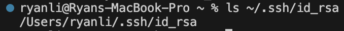
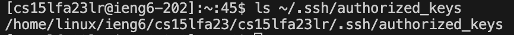

# Lab Report 2

## Part 1

``` bash
import java.io.IOException;
import java.net.URI;
import java.util.ArrayList;

class Handler implements URLHandler {
    // The one bit of state on the server: a number that will be manipulated by
    // various requests.
    ArrayList<String> messageList = new ArrayList<>();
    

    public String handleRequest(URI url) {
        if (url.getPath().equals("/")) {
            //handles an empty message list
            if (messageList.isEmpty()){
                return "Empty message list!";
            } else {
                //builds line by line if the messageList is not empty
                StringBuilder allMessages = new StringBuilder();
                for (int i = 0; i < messageList.size(); i++) {
                    allMessages.append((i+1)).append(". ").append(messageList.get(i)).append("\n");
                }
                return allMessages.toString();
            }
        }
        //adds message if URL contains a message and places the given message to
        //messageList
        else if (url.getPath().contains("/add-message")) {
            String[] parameters = url.getQuery().split("=");
            if (parameters[0].equals("s")) {
                messageList.add(parameters[1]);
                return "Message successfully added";
            }
        }
        return "Invalid request!";
    }
}

class StringServer {
    public static void main(String[] args) throws IOException {
        if(args.length == 0){
            System.out.println("Missing port number! Try any number between 1024 to 49151");
            return;
        }

        int port = Integer.parseInt(args[0]);

        Server.start(port, new Handler());
    }
}

```


##### This screenshot shows the output if the url "localhost:4000/add-message?s=Hello" is executed. It uses the handleRequest method to properly format the new line by giving it a number, a period, the message itself, and then a "\n" to prepare for another message. Without any message, the message "Empty message list!" is given. In this case, the relevant arguments involve the handleRequest which takes in a url and separates it based on the path. In the case of just showing the messageList ArrayList, it takes in a "/" and creates a printed version of the messageList. The relevant fields change when messages are added and "add-message" is shown in the URL. The ArrayList is updated to show new information and contain messages that are passed into the URL.


##### This screenshot shows the output if the url "localhost:4000/add-message?s=How are you" is executed. As with the last message, it uses the handleRequest method to properly format the new line by giving it a number, a period, the message itself, and then a "\n" to prepare for another message. In this case, the relevant arguments are the parameters[0] and parameters[1] which find which part of the URL is the request and which part is the message itself. Again, the ArrayList is updated to show new information and contain messages that are passed into the URL.

##### This URL is converted to "localhost:4000/add-message?s=How%20are%20you" to handle the spaces

## Part 2

##### Image of private key


##### Image of public key


##### Image of login attempt without password


## Part 3
##### Something new that I learned in this lab was creating a new directory on a remote computer with the terminal, understanding the "url.getPath()" function, utilizing StringBuilder(), and that the GitHub error "Something went really wrong, and we can’t process that file." means that the file name is incorrect/incompatible with GitHub. Although this lab was much harder than the last one, after completing it, I feel like I have learned some lessons that I will take further into this class and the future. I'm becoming more familiar with navigating filestructures in terminal and was able to quickly navigate back to the right local directory after accidentally "cd"-ing on my own computer.
