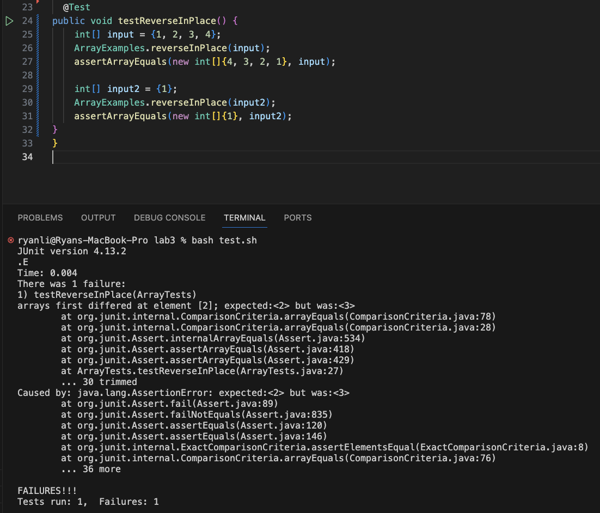
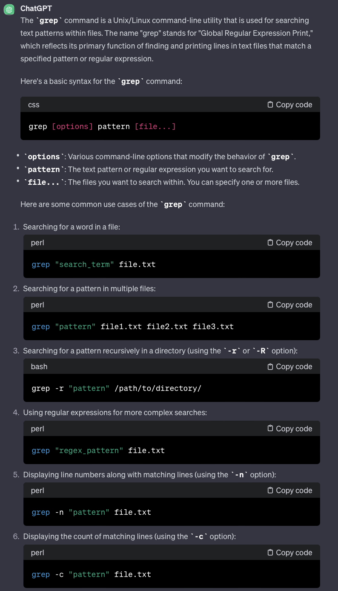
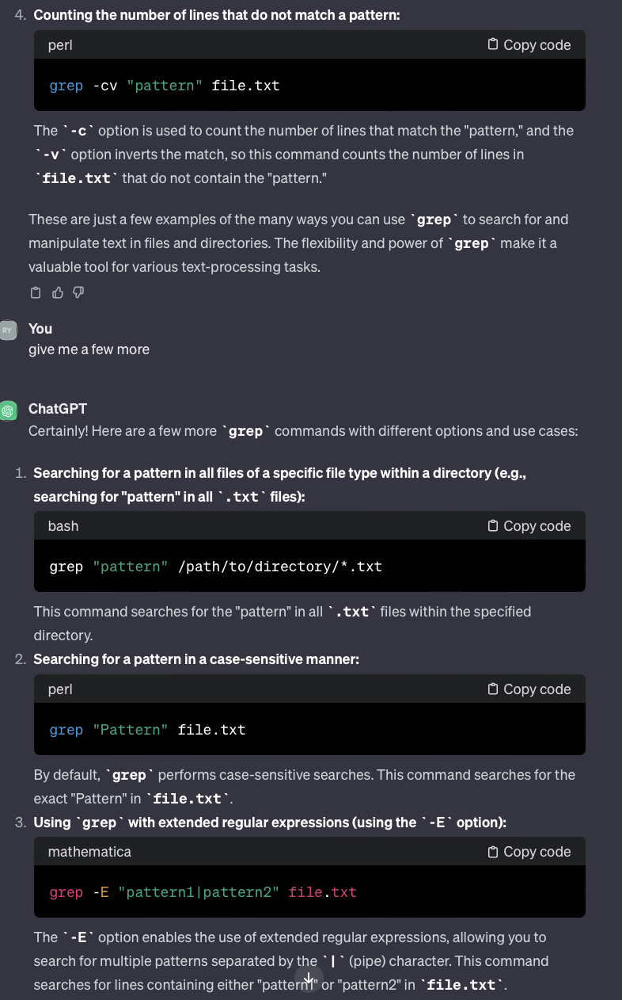
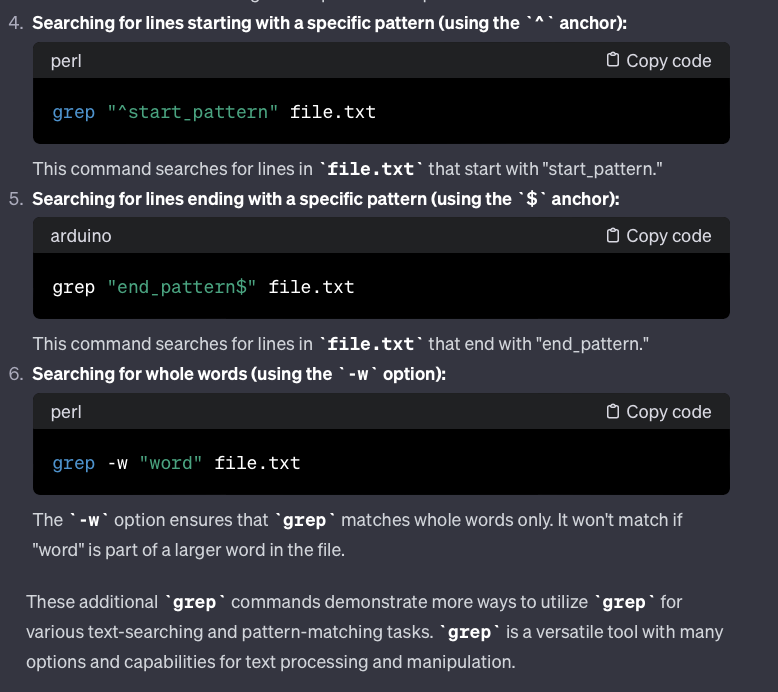

# Lab Report 3

___

## Part I:
### Provide:

### A failure-inducing input for the buggy program, as a JUnit test and any associated code (write it as a code block in Markdown)
```java
public class ArrayTests {
    @Test
  public void testReverseInPlace() {
      int[] input = {1, 2, 3, 4};
      ArrayExamples.reverseInPlace(input);
      assertArrayEquals(new int[]{4, 3, 2, 1}, input);
  }
}
```
### An input that doesn’t induce a failure, as a JUnit test and any associated code (write it as a code block in Markdown)
```java
public class ArrayTests {
    @Test
  public void testReverseInPlace() {
      int[] input = {3};
      ArrayExamples.reverseInPlace(input);
      assertArrayEquals(new int[]{3}, input);
  }
}
```
### The symptom, as the output of running the tests (provide it as a screenshot of running JUnit with at least the two inputs above)

### The bug, as the before-and-after code change required to fix it (as two code blocks in Markdown)
##### reverse method Before:
```java
 // Changes the input array to be in reversed order
  static void reverseInPlace(int[] arr) {
    for(int i = 0; i < arr.length; i += 1) {
      arr[i] = arr[arr.length - i - 1];
    }
  }
```
##### reverse method After:
```java
// Changes the input array to be in reversed order
  static void reverseInPlace(int[] arr) {
    int[] newArray = new int[arr.length];
    for(int i = 0; i < arr.length; i += 1) {
        newArray[i] = arr[arr.length - i - 1];
    }
    for(int i = 0; i < arr.length; i++){
        arr[i] = newArray[i];
    }
  }
```
### Briefly describe why the fix addresses the issue.
##### Before fixing the issue, the method would parse over the array, replacing the first elements before being able to move the first elements to the end. This is not the intended effect since it would effectively result in an array that is only partially reversed. {1, 2, 3, 4} would end up looking like {4, 3, 3, 4} since the last two elements are reversed in reference to the beginning of the array. In order to fix this, a temporary array is created to move each item to a fresh "workspace", thus allowing the overwriting problem to be resolved.

___
## Part II:

##### Example 1: "-i" (Ignore Case) and "-r" (Recursive)

```java
ryanli@Ryans-MacBook-Pro docsearch % grep -i -r "ABC News" ./technical/*
./technical/911report/chapter-13.3.txt:                admiration. See ABC News interview, "To Terror's Source," May 28, 1998. In late
./technical/911report/chapter-13.3.txt:                see ABC News interview,"To Terror's Source," May 28, 1998.
./technical/911report/chapter-13.3.txt:            93. ABC News interview, "Terror Suspect: An Interview with Osama Bin Laden," Dec. 22,
./technical/911report/chapter-13.3.txt:                1998 (conducted in Afghanistan by ABC News producer Rahimullah Yousafsai).
./technical/911report/chapter-2.txt:                that, Bin Ladin gave a videotaped interview to ABC News with the same slogans,
```
##### Example 2: "-i" (Ignore Case) and "-r" (Recursive)

```java
ryanli@Ryans-MacBook-Pro docsearch % grep -i -r "abc news" ./technical/* 
./technical/911report/chapter-13.3.txt:                admiration. See ABC News interview, "To Terror's Source," May 28, 1998. In late
./technical/911report/chapter-13.3.txt:                see ABC News interview,"To Terror's Source," May 28, 1998.
./technical/911report/chapter-13.3.txt:            93. ABC News interview, "Terror Suspect: An Interview with Osama Bin Laden," Dec. 22,
./technical/911report/chapter-13.3.txt:                1998 (conducted in Afghanistan by ABC News producer Rahimullah Yousafsai).
./technical/911report/chapter-2.txt:                that, Bin Ladin gave a videotaped interview to ABC News with the same slogans,
```
##### These two examples show a recursive search for files that contain the phrase "abc news" demonstrating its ability to ignore case and also perform a recursive search within the directories inside ./technical. This is useful for finding mentions of names that don't always have the same consistency, or if a user wanted to search for files without worry of matching a phrase perfectly such as words that are capitalized at the beginning of a sentence versus within. If grep is just used on the directory, it won't have any files to search through, so most of these commands will be recursive to get to the text files.

##### Example 3: "-r" (Invert Match) and "-r" (Recursive)

```java
ryanli@Ryans-MacBook-Pro docsearch % grep -n -r "banana" ./technical/*
./technical/biomed/1471-2105-3-6.txt:123:          fond of bananas." and "I am of very fond bananas. Am I a
./technical/biomed/1471-2105-3-6.txt:219:          of bananas.", has USM coordinates 
./technical/biomed/1471-2105-3-6.txt:302:          bananas ". The matching of the two
```

##### Example 4: "-r" (Invert Match) and "-r" (Recursive)

```java
ryanli@Ryans-MacBook-Pro docsearch % grep -n -r "piano" ./technical/*
./technical/government/Media/predatory_loans.txt:94:to accommodate a grand piano that Linn played. But the series of
./technical/government/Media/A_helping_hand.txt:90:piano daily at the 6:30 a.m. Mass.
./technical/plos/journal.pbio.0020337.txt:35:        discrete strings of a piano, that are set into sympathetic vibration by incoming sound
./technical/plos/journal.pbio.0020337.txt:105:        strings of a piano submerged in water would be. He concludes that, to make ‘an underwater
./technical/plos/journal.pbio.0020337.txt:106:        piano’ work, we would have to add sensors and actuators to every string so that once a
./technical/plos/journal.pbio.0020337.txt:109:        piano would work again.’
./technical/plos/journal.pbio.0020337.txt:110:        My research is investigating what Gold's underwater piano strings might be. A suggestion
./technical/plos/journal.pbio.0030137.txt:52:        arranged along one dimension, as on a piano keyboard. Because of the parallel processing of
```
##### Both of these examples make use of the "-n" command which numbers the line within the file that shows a string. This is useful if I wanted to find specific portions of text where a string is shown. Like the previous commend, I used -r so the grep command would search the .txt files within the ./technical directory

##### Examples 5: "-c" (Count Lines) and "-r" (Recursive)

```java
ryanli@Ryans-MacBook-Pro docsearch % grep -c -r "and" ./technical/*
./technical/911report/chapter-13.4.txt:650
./technical/911report/chapter-13.5.txt:762
./technical/911report/chapter-13.1.txt:377
./technical/911report/chapter-13.2.txt:295
./technical/911report/chapter-13.3.txt:351
./technical/911report/chapter-3.txt:926
./technical/911report/chapter-2.txt:289
./technical/911report/chapter-1.txt:243
./technical/911report/chapter-5.txt:383
./technical/911report/chapter-6.txt:484
./technical/911report/chapter-7.txt:471
./technical/911report/chapter-9.txt:569
./technical/911report/chapter-8.txt:225
```
##### Examples 6: "-c" (Count Lines) and "-r" (Recursive)
```java
ryanli@Ryans-MacBook-Pro docsearch % grep -c -r "dog" ./technical/*
./technical/911report/chapter-13.4.txt:0
./technical/911report/chapter-13.5.txt:0
./technical/911report/chapter-13.1.txt:0
./technical/911report/chapter-13.2.txt:0
./technical/911report/chapter-13.3.txt:1
./technical/911report/chapter-3.txt:2
./technical/911report/chapter-2.txt:0
./technical/911report/chapter-1.txt:0
./technical/911report/chapter-5.txt:1
```
##### These two examples are just a small snippet of the output due to the length of output. The command searches through all the files in the directories and lists the number of lines the given string is found in. This is useful to find frequencies of words such as "and". It could also be useful to find the frequency of the word "like" in a conversation transcript. These are just a few examples of what the applications of a command like this is. Again, just like the others, it uses the "-r" (recursive) command to search within the directories and not just the directories themselves.

##### Example 7: "-w" (Whole Word) and "-r" (Recursive)
```java
ryanli@Ryans-MacBook-Pro docsearch % grep -w -r "platypus" ./technical/* 
./technical/biomed/1472-6947-3-8.txt:            example, the platypus has challenged animal
./technical/biomed/1471-2105-3-2.txt:            platypus (
```

##### Example 8: "-w" (Whole Word) and "-r" (Recursive)

```java
ryanli@Ryans-MacBook-Pro docsearch % grep -w -r "pot" ./technical/*
./technical/biomed/1472-6882-1-10.txt:          One respondent claimed that pot bush ( 
./technical/biomed/1472-6882-1-10.txt:          vinegar as an alternative to the 'scratchy' pot. Another
./technical/government/Media/Good_guys_reward.txt:in the south Bethlehem melting pot where he's crafted a law
./technical/plos/journal.pbio.0020161.txt:        to recover grants at least equal to their contributions to the EU pot (see Box 1).
```

##### A command such as this is very powerful because it's able to find only the phrase given. In the case of platypus, it doesn't matter that much since it's a fairly unique word, but with something such as pot (potentially a part of many words such as potential, hypothesis, spot, etc) it can be more useful. Again, this used the "-r" command to search through the files within the ./technical directory
___
## Citations
### ChatGPT
##### Prompt: Give me a few examples of how I can alternatively use the grep command






