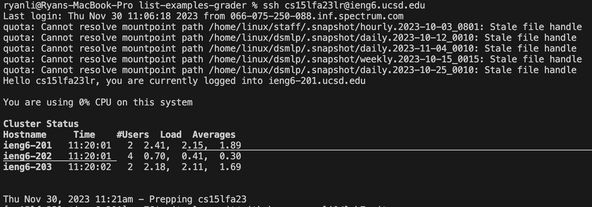
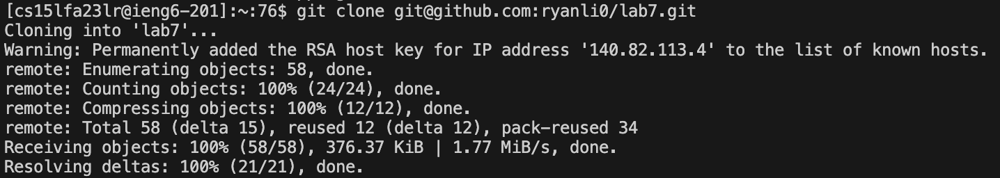
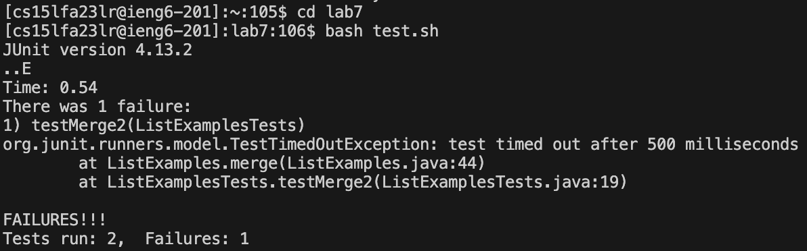
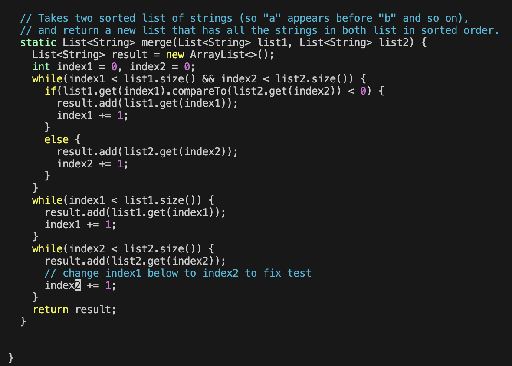
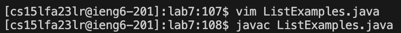
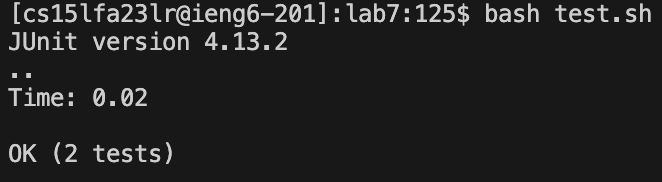
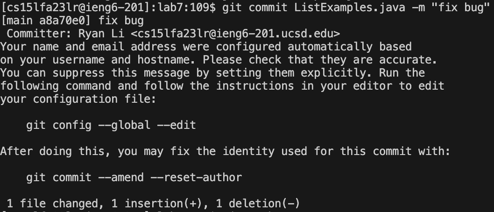
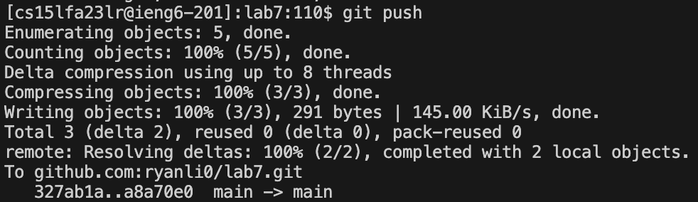

# Lab Report 4

## Step 4: Log into ieng6
#### “ssh cs15lfa23lr@ieng6.ucsd.edu" 
```bash
<enter> #logs into ieng6
```


## Step 5: Clone your fork of the repository from your Github account (using the SSH URL)
#### “git clone git@github.com:ryanli0/lab7.git”
```bash
<enter> #clones repository using SSH URL
```

### Step 6: Run the tests, demonstrating that they fail
#### “cd lab7” 
```bash
<enter> #I have to cd into the proper directory before running any tests
```
#### “bash test.sh” 
```bash
<enter> #runs test and fails since bugs exist
```

### Step 7: Edit the code file to fix the failing test
#### “vim ListExamples.java” 
```bash
<enter> #enters vim mode
<esc> “:44” <enter> #shortcut to line 44 where the error is
<l><l><l><l><l><l><i><bkspace><2><esc>”:x” #moves cursor to proper character, enables insert mode,
#deletes bug and replaces it with correct character, exits insert mode, saves and exits with ":x"
```

#### "javac ListExamples.java"
```bash
<enter> #compiles code so when run again it contains new edits
```

### Step 8: Run the tests, demonstrating that they now succeed
#### “bash test.sh” 
```bash
<enter> #runs tests again and gets passing result after edits
```

### Step 9: Commit and push the resulting change to your Github account
#### “Git commit ListExamples.java -m “fix bugs” 
```bash
<enter> #commits file with message "fix bugs"
```

#### “Git push”
```bash
<enter> #pushes file to main directory and updates edits
```


#### All in all, this process takes about a minute and a half
