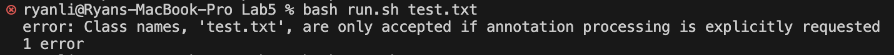
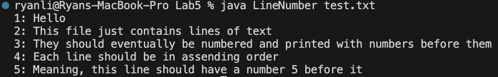
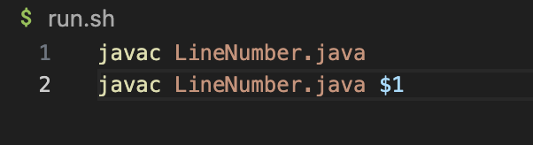

# Lab Report 5
## Original post

#### John Smith | Dec 1, 2023 9:41am
##### Hey Everyone,
##### I'm stuck trying to figure out this bug that is displayed in the screenshot below. I can't seem to figure out how to resolve it. I've been working on a Java program that reads a text file and prints each line with line numbers. I wrote a Bash script to compile and run the program, but the output isn't what I expected. Instead of numbering the lines, it just prints the contents of the file without any numbers.
##### Below is a screenshot of the output I'm getting:
##### 
##### I think the issue might be with the way I'm reading the file in Java, or maybe how I'm passing the filename to the Java program in the Bash script. I'm using the command `bash run.sh test.txt` to run the script.
##### Any help would be greatly appreciated!

___

## Response from TA

#### John Appleseed | Dec 1, 2023 2:41pm
##### Hey John,
##### It seems like the issue could be within the Java code or the bash script. Can you try running the Java code with the command 'java LineNumber test.txt' and see if it works as intended? Hopefully by doing this, we can isolate where your issue is coming from and proceed from there.
##### Good luck!

___
## Response from student

#### John Smith | Dec 1, 2023 5:41pm
##### I ran the program with the command you provided and everything worked as intended! I put a screenshot below:
##### 
##### So after isolating the issue, it does seem to be coming from the bash script itself. I've been trying to figure it out, but just in case you have any suggestions, I put the bash script below:
##### 

---
## Detailed Bug Report

#### File and directory structure
```bash
lab5
  LineNumber.java
  LineNumber.class
  run.sh
```
#### Contents of relevant file before fixing bug
```bash
javac LineNumber.java
javac LineNumber $1
```
#### Command line to trigger bug
```bash
bash run.sh #This caused the bug in rush.sh to prevent proper function
```
#### How to fix bug
##### On line 2 of run.sh, instead of 'java' to run the class, it says 'javac' which tries to recompile with an argument which doesn't work

## Reflection
##### I learned a lot more in this second half after I got through some initial roadblocks of not knowing what was happening in the class. After fixing some bad habits and keeping up with the material, I feel as though I have a much better understanding of what this class is intended on teaching its students. I'm much more comfortable with terminal and git. Terminal and the accessibility of git changed my perspective on the interconnectedness of computers. I don't recall a specific thing I learned, but I just overall feel much more comfortable having taken this class. I obviously have much more to learn, but I wouldn't be opposed to learning some things in my free time now that I understand more about Github.
